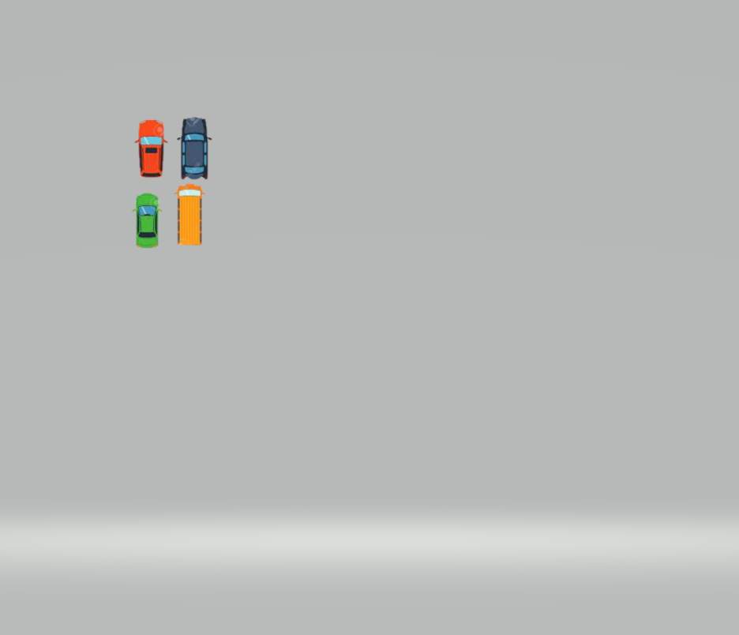

# Core-Marc-Rae-Rally

## Tecnologías aplicadas:

node.js, typescript, vite, bootstrap.

## imágenes:




## Motivación del proyecto:

Este proyecto forma parte del bootcamp que actualmente estoy cursando en corecodeschool.

## estructura del proyecto:

```
├───docs/
│ ├───assets/
│ │ ├───carros.6688e9a7.png
│ │ ├───index.f180def3.js
│ │ └───road.3ee0571f.png
│ ├───index.html
│ └───styles.css
├───public/
│ └───styles.css
├───src/
│ ├───sprites/
│ │ ├───carros.jpg
│ │ ├───carros.png
│ │ ├───elGrass.png
│ │ ├───meta.png
│ │ ├───road.png
│ │ └───SNES Water.png
│ ├───types/
│ │ └───point.ts
│ ├───utils/
│ │ ├───angleLimit.ts
│ │ ├───angleToRad.ts
│ │ ├───checklimits.ts
│ │ └───Timer.ts
│ ├───Actor.ts
│ ├───Barrier.ts
│ ├───car.ts
│ ├───crono.ts
│ ├───fpsViewer.ts
│ ├───Map.ts
│ ├───Pacman.ts
│ ├───script.ts
│ └───server.js
├───.gitignore
├───index.d.ts
├───index.html
├───LICENSE.md
├───package-lock.json
├───package.json
├───README.md
└───tsconfig.json
```

## Acceso directo al juego:

https://alexconba.github.io/Core-Marc-Rae-Rally/

## índice:

## Manual de instalación y deployment:

Para inicializar el proyecto en tu local, necesario instalar `npm` .
con este comando creas la dependencias en `packege.json`.

## ejemplos de codigo:

función para limitar el giro del vehiculo :

```
 export const checkAngle = (angle: number) => {
if (angle < 25 && angle > -25) {
return true;
}
return false;
};

```

## entorno de ejecucion:

node.js, vite.

## variables globales:

## listado de paquetes y dependencias:

## estadisticas:

## License:

[MIT](https://choosealicense.com/licenses/mit/)

## Agradecimientos:

A Luis M. feijo, Alfonso, Jesús, Juan Pablo, julian, luis Cabo, Marcos Ínigo, Marc Pomar y Antoni B.

otros:
